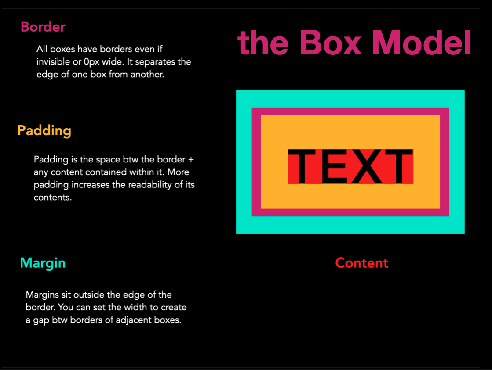

### Tuesday Februrary 20

### Async Classwork
##### Read / Code Along Text Book:
* [Type, class and ID selectors](https://developer.mozilla.org/en-US/docs/Learn/CSS/Building_blocks/Selectors/Type_Class_and_ID_Selectors)
* [Handeling different text directions](https://developer.mozilla.org/en-US/docs/Learn/CSS/Building_blocks/Handling_different_text_directions)
* [Styling Links](https://developer.mozilla.org/en-US/docs/Learn/CSS/Styling_text/Styling_links)
* [Intro to CSS](https://developer.mozilla.org/en-US/docs/Learn/CSS/CSS_layout/Introduction)

#### Assignment 4
0. Build out your homepage with links to each week's assignment. Post a link to our Discord server. By next class you must give at least three of your classmates constructive feedback on their post.  
1. Do these two tutorials:
  * [CSS positioning tutorial](https://developer.mozilla.org/en-US/docs/Learn/CSS/CSS_layout/Positioning) 
  *[mutiple-colum layout](https://developer.mozilla.org/en-US/docs/Learn/CSS/CSS_layout/Multiple-column_Layout)- 
3. Using what you learned from the above tutorials - create a website with an external styling sheet that responds to this [6 page long reading](https://oldobjectsnewideas.com/_reading/Manovich_NewMedia_2.pdf) - Lev Manovich, 2004
5. **note** you will be quizzed on your knowledge of the first four weeks of material next class

